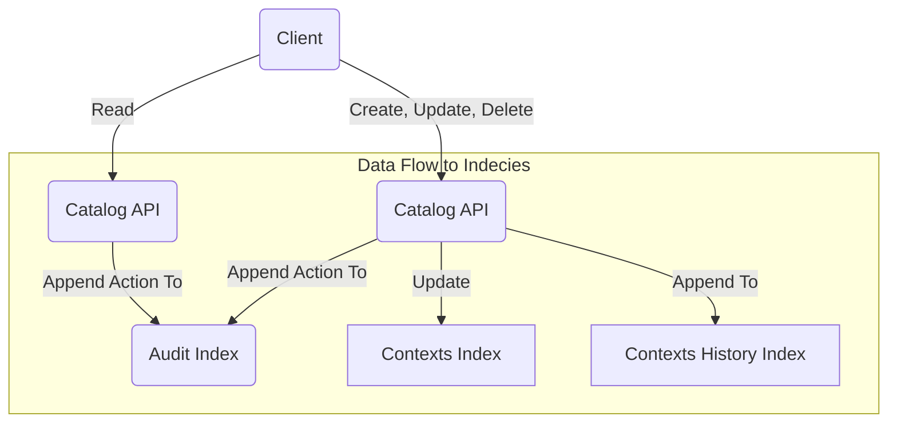

## Description

I'm often rooting around in various datasets - darkweb dumps, netflow data, weather info, etc. And every time
find myself thinking something along the lines of

> Damn, it would be awesome if I could start to catalog these searches and represent them all in a single format without
> losing fidelity

Well, this is the (very rough) product of that ballmers-peak inspired headache with pictures.

### Enter Egregore, a catalog for the classification and organization of sets of searches

## Terms

To get an idea of what this catalog does, lets start with a few terms

### Query

A `query` is the most basic conceptual component, describing a very simple search. Take `url=luxuriousneckbeards.com` as
an example. This string can be broken apart into an object, and would be stored as a structure that
resembles the following

```json
{
  "field": "url",
  "operator": "=",
  "value": "luxuriousneckbeards.com"
}
```

Queries like this represent a single ~thing that you may want to search for. These are arbitrary by design, but should
follow this format - the idea is that you should modify this system to accommodate your use case. You likely should put
guardrails around what fields are allowed, and probably what operators (and value datatypes) are allowed for any given
field.

### Search

The next higher-order piece is a `search`. A `search` represents what you might actually _search_ for - any one ~thing
that would get sent to the data backend for execution. A `search` is more complex than a single `query` and is more
representative of what a human would want to use to actually look for something in the data backend

Searches are comprised of one or more `query` objects, and includes some additional information about how to stitch
those objects together. Lets look at the following example

```json
{
  "start": null,
  "stop": null,
  "operator": "AND",
  "queries": [
    {
      "field": "url",
      "operator": "=",
      "value": "luxuriousneckbeards.com"
    },
    {
      "field": "url",
      "operator": "=",
      "value": "myautism.rocks"
    }
  ]
}
```

This `search` outlines that, when executed by the data backend, results should be returned if they match _both_ `query`
objects (due to the `AND` in the top-level `"operator"` field)

Valid options for the top-level `operator` field are either `AND`, or `OR`. Boolean logic.

The `start` and `stop` fields are present to allow for time-range restrictions. Valid values are ISO formatted
timestamps (UTC)

### Context

A `context` is a parent container that adds a bunch of supplemental information to one or more `searches`.

```json
{
  "name": "Docs Example",
  "description": "A quick example of what a complete Context structure would look like. This context has two searches. Each searchs' results can be described by the metadata that this context provides.",
  "type": "Group",
  "groups": [
    "group 1",
    "groups 2"
  ],
  "references": [
    {
      "name": "A Quick Google Search",
      "link": "https://www.google.com/search?q=lorem+ipsum",
      "description": "A google search for Lorum Ipsum",
      "source": "Google"
    }
  ],
  "searches": [
    {
      "start": null,
      "stop": null,
      "operator": "AND",
      "queries": [
        {
          "field": "url",
          "operator": "=",
          "value": "luxuriousneckbeards.com"
        },
        {
          "field": "url",
          "operator": "=",
          "value": "myautism.rocks"
        }
      ]
    },
    {
      "start": null,
      "stop": null,
      "operator": "OR",
      "queries": [
        {
          "field": "url",
          "operator": "=",
          "value": "rastahorn.com"
        }
      ]
    }
  ]
}
```

#### Type

One of the MITRE ATT&CK Cyber Threat Intel components - `Group`, `Software`, or `Campaign`

#### Groups

An array of arbitrary strings to help _group_ multiple `Contexts` together. This is not an all match, a given context
can belong to more than one group

## Architecture

This project is written in Python using FastAPI and OpenSearch. I tried playing with Quart since I really love flask,
but it's pretty far behind FastAPI in terms of documentation

If you'd like to set up a local OpenSearch Docker Stack to test and play with this API, check
out [this guide](https://github.com/flavienbwk/opensearch-docker-compose/blob/main/README.md) to getting spun up

### API Request Flow

All API requests are audited, and any modification to a given context is preserved in a historical record. The below
flow chart describes where data is written to for a given request type



### Installation

TODO: need to document how to spin this up as the project moves along

## Future Ideas

- Work in harmony with an Async data backend to perpetually apply contexts to a stream of data / on a recurring basis
- Add additional fields to support workflows (eg when working with others, dont clobber others' work, state tracking,
  etc)
- Add field to handle visibilities (TLP levels)
- Add ability to add links to other contexts (things contexts that are related to other contexts)
