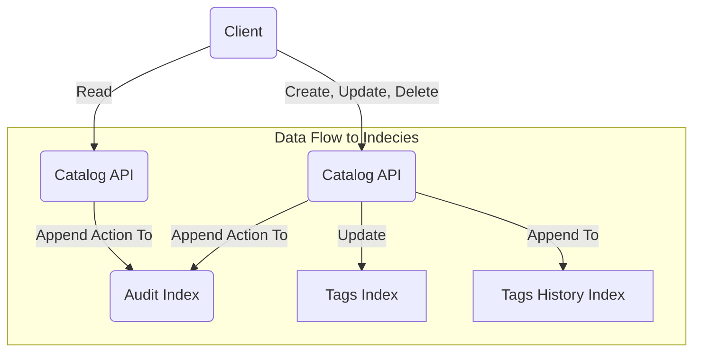

## Description

I'm often rooting around in various datasets - darkweb dumps, netflow data, weather info, etc. And every time
find myself thinking something along the lines of

> [!TIP]
> Damn, it would be awesome if I could start to catalog these searches and represent them all in a single format without
> losing fidelity

Well, this is the (very rough) product of that ballmers-peak inspired headache with pictures.

### Enter Egregore, a catalog for the classification and organization of sets of searches

## Quickstart

You can literally just ensure all the deps are installed and start the server, then hit `/docs` to get to the
interactive docs. Of course, without a backend, none of the routes will work, but you can at least see the API "up" and
peruse the docs

1. Clone this repo
2. CD into the directory
3. `pip install -r requirements.txt`
4. Run `python -m uvicorn app.app:app`
5. Open a browser and load `http://localhost:8000/docs`

### Getting Going

If you're loading this up in JetBrains, do the following

- Set the run config to be a `Module`, pointing to `app.main` and you should be good to go!
- Point your `Paths to .env files` section at a file you create that's a clone of [the example `.env` file](.env) with
  the info filled out appropriately. Make sure you familiarize yourself with the options.

If you'd like to set up a local OpenSearch Docker Stack to test and play with this API, check
out [this guide](https://github.com/flavienbwk/opensearch-docker-compose/blob/main/README.md) to getting spun up. Takes
less than 5 minutes, then update the env vars accordingly.

### Images

This will eventually have a Dockerfile that works. IDK, maybe it works now, but it hasn't been a priority yet.

## Terms

To get an idea of what this catalog does, lets start with a few terms

### Clause

A `clause` is the most basic conceptual component, describing a very simple search. Take `url=luxuriousneckbeards.com`
as an example. This string can be broken apart into an object, and would be stored as a structure that
resembles the following

```json
{
  "field": "url",
  "operator": "=",
  "value": "luxuriousneckbeards.com"
}
```

This represents a single ~thing that you may want to search for. These are arbitrary by design, but should
follow this format - the idea is that you should modify this system to accommodate your use case. You likely should put
guardrails around what fields are allowed, and probably what operators (and value datatypes) are allowed for any given
field.

### Pattern

The next higher-order piece is a `pattern`. A `pattern` represents what you might actually _search_ for - any one ~thing
that would get sent to the data backend for execution. A `pattern` is more slightly complex than a single `query` and is
more representative of what a human would want to use to actually look for something in the data backend

`Patterns` are comprised of one or more `clause` objects, and include some additional information about how to stitch
those objects together. Let's look at the following example

```json
{
  "start": null,
  "stop": null,
  "operator": "AND",
  "clauses": [
    {
      "field": "url",
      "operator": "=",
      "value": "luxuriousneckbeards.com"
    },
    {
      "field": "url",
      "operator": "=",
      "value": "rastahorn.com"
    }
  ]
}
```

This `pattern` outlines that, when executed by the data backend, results should be returned if they match
_both_ `clause` objects (due to the `AND` in the top-level `"operator"` field)

Valid options for the top-level `operator` field are either `AND`, or `OR`. Boolean logic.

The `start` and `stop` fields are present to allow for time-range restrictions. Valid values are ISO formatted
timestamps (UTC), and are _optional_.

### Tag

A `tag` is a parent container that adds a bunch of supplemental information to one or more `pattern` objects.

```json
{
  "name": "Docs Example",
  "description": "A quick example of what a complete Tag structure would look like. This tag has two searches. Each searches' results can be described by the metadata that this context provides.",
  "type": "Group",
  "groups": [
    "group 1",
    "groups 2"
  ],
  "references": [
    {
      "name": "A Quick Google Search",
      "link": "https://www.google.com/search?q=lorem+ipsum",
      "description": "A google search for Lorem Ipsum",
      "source": "Google"
    }
  ],
  "patterns": [
    {
      "start": null,
      "stop": null,
      "operator": "AND",
      "clauses": [
        {
          "field": "url",
          "operator": "=",
          "value": "luxuriousneckbeards.com"
        },
        {
          "field": "url",
          "operator": "=",
          "value": "rastahorn.com"
        }
      ]
    },
    {
      "start": null,
      "stop": null,
      "operator": "OR",
      "clauses": [
        {
          "field": "url",
          "operator": "=",
          "value": "rastahorn.com"
        }
      ]
    }
  ]
}
```

#### Type

One of the MITRE ATT&CK Cyber Threat Intel components - `Group`, `Software`, or `Campaign` - or whatever other
classifiers you deem necessary!

#### Groups

An array of arbitrary strings to help _group_ multiple `Tags` together. This is not an all match, a given tag
can belong to more than one group

## Architecture

This project is written in Python using FastAPI and OpenSearch. I tried playing with Quart since I really love flask,
but it's pretty far behind FastAPI in terms of documentation

### API Request Flow

All API requests are audited, and any modification to a given tag is preserved in a historical record. The below
flow chart describes where data is written to for a given request type



### Installation

TODO: need to document how to spin this up as the project moves along

## Future Ideas

- Work in harmony with an Async data backend to perpetually apply tags to a stream of data / on a recurring basis
- Add additional fields to support workflows (eg when working with others, don't clobber others' work, state tracking,
  etc)
- Add field to handle visibilities (TLP levels)
- Add ability to add links to other tags (think tags that are related to other tags)
